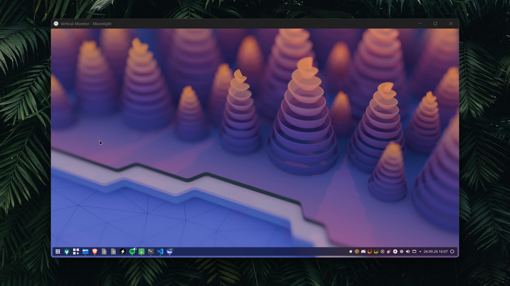
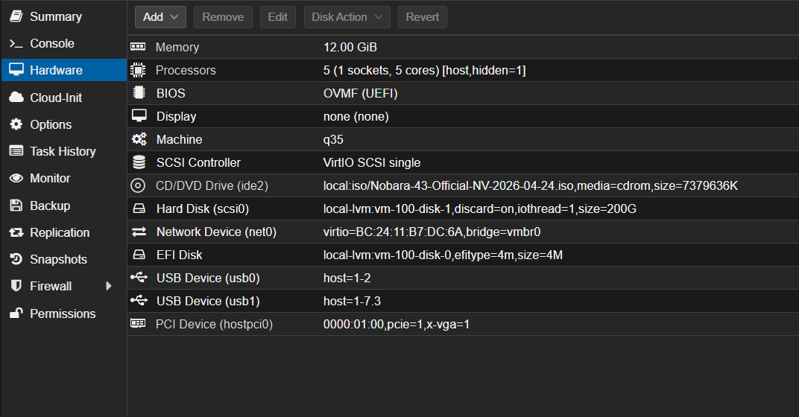
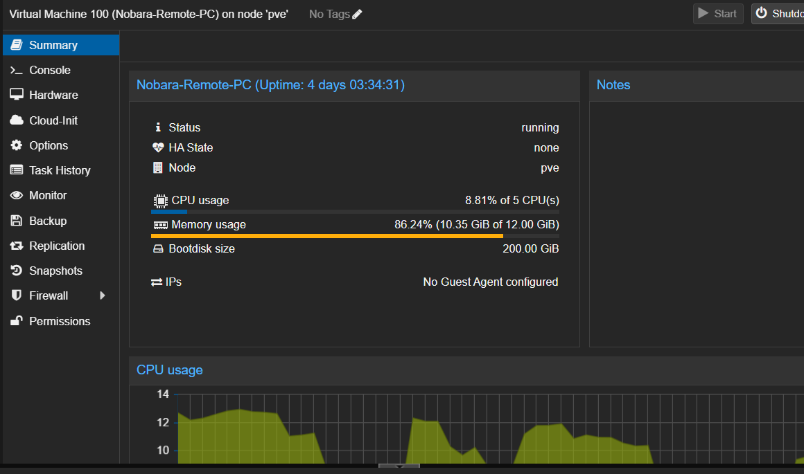

# Self-Hosted Remote Gaming PC &amp; Homelab Server

**Eigenbau-Cloud-Gaming-Server mit GPU-Passthrough**  Ein ehemaliger Desktop-PC umfunktioniert zum Homelab-Server, der eine hochperformante Gaming-VM für ortsunabhängiges Zocken über einen sicheren **WireGuard-VPN-Tunnel** bereitstellt.

---

## Inhaltsverzeichnis
- [Über das Projekt](#über-das-projekt)
- [Hardware &amp; VM-Allokation](#hardware--vm-allokation)
- [Architektur &amp; Remote Access](#architektur--remote-access)
- [Bildergalerie](#bildergalerie)
- [Repository-Struktur](#repository-struktur)
- [Autor](#autor)

---

## Über das Projekt

Dieses Projekt verwandelt bestehende Desktop-Hardware in einen vielseitigen **Home-Server mit dedizierter Gaming-Virtualisierung**. Durch den Einsatz von **PCIe/GPU-Passthrough** greift die virtuelle Maschine direkt und ohne spürbaren Performance-Verlust auf die Grafikkarte zu.

Das Ziel: **High-End-Gaming von jedem beliebigen Standort** auf schwachen Endgeräten (z. B. Office-Laptops oder Handhelds), solange eine stabile Internetverbindung besteht. Die Verbindung erfolgt direkt und verschlüsselt ins Heimnetzwerk.

---

## Hardware &amp; VM-Allokation

### Host-Server (Physische Hardware)
- **Prozessor:** Intel Core i5-12400F (6 Kerne / 12 Threads)
- **Arbeitsspeicher:** 16 GB DDR4 RAM
- **Grafikkarte:** NVIDIA GeForce RTX 3060 Ti (8 GB VRAM)

### Remote Gaming VM (Zugewiesene Ressourcen)
- **CPU:** 5 vCPU Cores (dediziert zugewiesen)
- **RAM:** 12 GB RAM
- **GPU:** Dedicated PCIe Passthrough der RTX 3060 Ti

---

## Architektur &amp; Remote Access

1. **GPU-Passthrough:**
   Die RTX 3060 Ti ist direkt an die Gaming-VM durchgereicht. Dadurch steht die volle Grafik- und Raytracing-Leistung ohne Virtualisierungs-Overhead zur Verfügung.

2. **Sicherer Netzwerk-Tunnel (WireGuard):**
   Für den Zugriff von unterwegs wird ein **WireGuard-VPN-Tunnel** aufgebaut. Das ermöglicht eine direkte, latenzarme P2P-Verbindung zum Heimserver ohne Freigabe unsicherer Ports im Router.

3. **Low-Latency Streaming:**
   Vom Client aus wird der Stream der VM empfangen. Selbst auf leistungsschwachen Laptops wird dadurch flüssiges Gameplay in hoher Qualität ermöglicht.

---

## Bildergalerie

*(Die Vorschaubilder zeigen Eindrücke des Server-Setups und des Remote-Setups)*


*Ansicht de Benutzers.*


*Proxmox Hardware.*


*Proxmox Summary.*

---

## Repository-Struktur

```text
├── image1.png
├── image2.png
├── image3.png
└── README.md

```

---

## Autor

**Daniel Fast** ([@Minielel](https://www.google.com/url?sa=E&amp;q=https%3A%2F%2Fgithub.com%2FMinielel))

* **Portfolio:** [daniel-fast.de](https://www.google.com/url?sa=E&amp;q=https%3A%2F%2Fwww.daniel-fast.de)